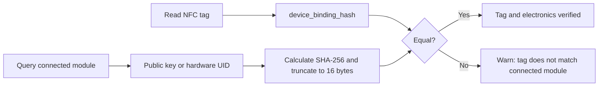
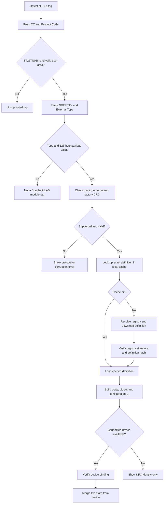
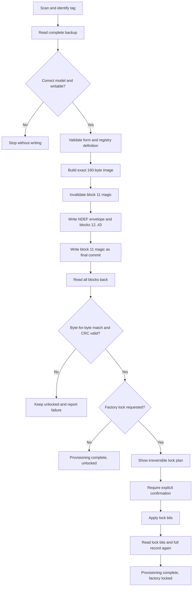

# Spaghetti LAB NFC Module Identity Protocol

Status: **draft protocol V1**

This document describes how a Spaghetti LAB module identifies itself through an
ST25TN01K NFC tag. It is intended for firmware, desktop-tool, registry, and
manufacturing-tool developers.

The design deliberately keeps the tag small and stable. The tag does not contain
the complete description of a module. Instead, it contains enough information to:

1. identify the module model;
2. identify the individual physical unit;
3. download the exact module definition from a registry;
4. verify that the downloaded definition is the expected one;
5. associate the NFC tag with the electronics connected to the software;
6. retain a small amount of installation-specific information.

Descriptions, icons, localized strings, block definitions, port definitions, and
other information that may evolve live in the module registry, not on the tag.

> Important: this document defines an application-level format stored in the
> ST25TN01K user memory. The names below are protocol fields, not ST25R reader
> registers.

## 1. Design principles

### 1.1 The tag is a passport, not a database

The NFC tag stores stable identity and lookup information. The registry stores the
large and changeable module definition. Live state comes from the connected device.

| Information | Source of truth |
|---|---|
| Module model and hardware revision | Locked NFC factory section |
| Individual unit identity | Locked NFC factory section |
| Ports, functions, blocks, labels, icons | Module registry and local cache |
| Current firmware and live status | Connected device |
| Installation role and assignment | Mutable NFC section plus project database |
| Electrical safety enforcement | Module firmware and hardware |

The NFC record must never be the only protection against an unsafe electrical or
mechanical configuration.

### 1.2 Three identities are intentionally separate

- `module_type_id` identifies a type of module, such as a specific Backbone model.
- `module_instance_id` identifies one physical unit of that type.
- `installation_id` identifies the installation or project to which the unit is
  currently assigned.

Two units of the same model therefore share a `module_type_id` but have different
`module_instance_id` values.

### 1.3 Functional definitions are immutable

The tuple below identifies one exact module definition:

```text
(registry_id, vendor_id, module_type_id, definition_revision)
```

Once published, a definition at that key must never change. A functional change
creates a new `definition_revision`. Presentation-only information such as labels,
translations, documentation, and icons may have a separate update lifecycle.

The runtime must not silently replace a pinned functional definition with `latest`.

## 2. Supported tag

Protocol V1 targets the **ST25TN01K**:

- NFC Forum Type 2 Tag;
- NFC-A / ISO/IEC 14443-A;
- passive operation at 13.56 MHz;
- 64 physical blocks of four bytes;
- blocks 4 through 43 available as the normal 160-byte user area;
- seven-byte chip UID;
- NDEF support;
- irreversible block-level write locks.

The device also contains ST system, identification, Augmented NDEF, and kill areas.
Those areas are outside this application protocol and must not be modified by a
normal provisioning tool.

## 3. High-level layout

The 160-byte user area contains one NFC Forum NDEF External Type record.

```text
ST25TN01K user memory: blocks 4..43, 160 bytes

┌──────────────┬───────────────┬────────────────┬────────────────┬─────────────┐
│ Blocks 4..10 │ Blocks 11..33 │ Blocks 34..41  │ Block 42       │ Block 43    │
│ NDEF header  │ Factory data  │ Installation   │ Mutable CRC    │ Terminator  │
│ 28 bytes     │ 92 bytes      │ 32 bytes       │ 4 bytes        │ 4 bytes     │
│ lock         │ lock          │ writable       │ writable       │ writable    │
└──────────────┴───────────────┴────────────────┴────────────────┴─────────────┘
```

The NDEF record type is:

```text
spaghettilab.com:module
```

The record contains a fixed 128-byte binary payload. The chosen type length aligns
the payload to the beginning of block 11 and aligns the factory/mutable boundary
with the ST25TN01K lock granularity.

## 4. Encoding rules

- Multi-byte integers use unsigned big-endian/network byte order.
- UUIDs are stored in RFC 4122 byte order, without text separators.
- Reserved bytes must be written as zero and ignored when read.
- CRC fields use CRC-32C/Castagnoli.
- Hash fields contain the first 16 bytes of SHA-256.
- Text is not stored in the protocol payload.
- A zero-filled optional field means "not set".
- Writers must reject values that do not fit their assigned width; truncation is
  not allowed except for the explicitly truncated SHA-256 fields.

## 5. NDEF envelope: blocks 4 through 10

The NDEF message is 154 bytes. Its 128-byte payload begins at block 11.

| Block | Bytes | Value | Meaning |
|---:|---|---|---|
| 4 | 0 | `03` | NDEF Message TLV |
| 4 | 1 | `9A` | NDEF message length: 154 bytes |
| 4 | 2 | `D4` | First and last record, short record, External Type |
| 4 | 3 | `17` | Type length: 23 bytes |
| 5 | 0 | `80` | Payload length: 128 bytes |
| 5 | 1..3 | `spa` | External Type bytes 0..2 |
| 6 | 0..3 | `ghet` | External Type bytes 3..6 |
| 7 | 0..3 | `tila` | External Type bytes 7..10 |
| 8 | 0..3 | `b.co` | External Type bytes 11..14 |
| 9 | 0..3 | `m:mo` | External Type bytes 15..18 |
| 10 | 0..3 | `dule` | External Type bytes 19..22 |

The complete type bytes are the UTF-8/ASCII representation of
`spaghettilab.com:module`.

## 6. Payload map: blocks 11 through 42

Payload offsets are relative to the first byte of block 11.

### 6.1 Complete block map

| Block | Payload offset | Field | Purpose |
|---:|---:|---|---|
| 11 | `0x00..0x03` | `magic` | Identifies this protocol |
| 12 | `0x04..0x07` | Version, flags, length | Parser and compatibility control |
| 13 | `0x08..0x0B` | Registry and vendor IDs | Selects the definition authority |
| 14 | `0x0C..0x0F` | `module_type_id` | Selects the module model |
| 15 | `0x10..0x13` | `definition_revision` | Pins the functional definition |
| 16 | `0x14..0x17` | `hardware_revision` | Selects hardware-specific behavior |
| 17 | `0x18..0x1B` | Instance ID bytes 0..3 | Physical-unit UUID |
| 18 | `0x1C..0x1F` | Instance ID bytes 4..7 | Physical-unit UUID |
| 19 | `0x20..0x23` | Instance ID bytes 8..11 | Physical-unit UUID |
| 20 | `0x24..0x27` | Instance ID bytes 12..15 | Physical-unit UUID |
| 21 | `0x28..0x2B` | Binding hash bytes 0..3 | Binds tag to electronics |
| 22 | `0x2C..0x2F` | Binding hash bytes 4..7 | Binds tag to electronics |
| 23 | `0x30..0x33` | Binding hash bytes 8..11 | Binds tag to electronics |
| 24 | `0x34..0x37` | Binding hash bytes 12..15 | Binds tag to electronics |
| 25 | `0x38..0x3B` | Definition hash bytes 0..3 | Verifies registry response |
| 26 | `0x3C..0x3F` | Definition hash bytes 4..7 | Verifies registry response |
| 27 | `0x40..0x43` | Definition hash bytes 8..11 | Verifies registry response |
| 28 | `0x44..0x47` | Definition hash bytes 12..15 | Verifies registry response |
| 29 | `0x48..0x4B` | Serial number, high word | Manufacturing serial |
| 30 | `0x4C..0x4F` | Serial number, low word | Manufacturing serial |
| 31 | `0x50..0x51` | `manufacturing_lot` | Manufacturing traceability |
| 31 | `0x52..0x53` | `manufacturing_date` | Manufacturing traceability |
| 32 | `0x54..0x55` | `fallback_class` | Minimal offline classification |
| 32 | `0x56..0x57` | `fallback_flags` | Minimal offline capabilities |
| 33 | `0x58..0x5B` | `factory_crc32c` | Factory-section integrity |
| 34 | `0x5C..0x5F` | Installation ID bytes 0..3 | Project assignment |
| 35 | `0x60..0x63` | Installation ID bytes 4..7 | Project assignment |
| 36 | `0x64..0x67` | Installation ID bytes 8..11 | Project assignment |
| 37 | `0x68..0x6B` | Installation ID bytes 12..15 | Project assignment |
| 38 | `0x6C..0x6F` | `role_id` | Role inside the installation |
| 39 | `0x70..0x73` | `config_revision` | Conflict detection counter |
| 40 | `0x74..0x77` | `user_flags` | Installation state |
| 41 | `0x78..0x7B` | Reserved | Future mutable extension |
| 42 | `0x7C..0x7F` | `installation_crc32c` | Mutable-section integrity |

Block 43 contains `FE 00 00 00`: the NDEF Terminator TLV followed by padding.

### 6.2 Header fields

#### `magic`, block 11

```text
53 4C 4D 31    ASCII "SLM1"
```

A parser must reject the record if the magic does not match. The magic is also the
final commit marker during programming: it is written last.

#### Version and flags, block 12

| Offset | Field | V1 value |
|---:|---|---:|
| `0x04` | `schema_major` | `1` |
| `0x05` | `schema_minor` | `0` |
| `0x06` | `factory_flags` | Bit field |
| `0x07` | `payload_length` | `128` |

`factory_flags`:

| Bit | Name | Meaning |
|---:|---|---|
| 0 | `HAS_DEVICE_BINDING` | `device_binding_hash` is populated |
| 1 | `HAS_DEFINITION_HASH` | `definition_hash` is populated |
| 2 | `HAS_FALLBACK_SUMMARY` | `fallback_class` and flags are populated |
| 3 | `PRODUCTION_UNIT` | Unit passed production provisioning |
| 4..7 | Reserved | Must be zero in V1 |

Actual lock state must be read from the ST25TN01K lock bits. The flag does not claim
that memory is physically locked.

### 6.3 Registry lookup fields

#### `registry_id`, unsigned 16-bit

Identifies a registry authority known to the software. The application ships with
a signed mapping from registry ID to registry base URL and trust keys. A tag does
not store an arbitrary URL.

#### `vendor_id`, unsigned 16-bit

Identifies a vendor inside the registry.

#### `module_type_id`, unsigned 32-bit

Identifies the module model inside the vendor namespace. It is not an instance ID.

#### `definition_revision`, unsigned 32-bit

Pins an immutable functional definition. A change to ports, functions, electrical
metadata, configuration schema, or runtime semantics requires a new revision.

#### `hardware_revision`, unsigned 32-bit

Identifies the physical hardware revision. The registry decides how the numeric
value is presented to humans. Software logic compares the numeric value, not a
formatted label such as `Rev B`.

### 6.4 Physical-unit identity

#### `module_instance_id`, 128 bits

This is a random or centrally allocated UUID generated during manufacturing. It
must not be derived only from the NFC UID.

It is used as the primary key for:

- manufacturing records;
- ownership and warranty;
- maintenance history;
- installation assignments;
- user-defined aliases;
- replacement tracking.

#### `serial_number`, unsigned 64-bit

This is a human-facing manufacturing serial. Formatting rules live in the registry.
For example, the stored value `4812` may be displayed as `BB2C-2026-004812`.

### 6.5 Binding the tag to the connected device

`device_binding_hash` contains the first 16 bytes of:

```text
SHA-256(device_public_key)
```

If a device key is not available, a documented hardware identity may be used:

```text
SHA-256(hardware_uid || vendor_id)
```

When the module is connected, the software asks it for the corresponding public
key or hardware identity, calculates the same hash, and compares it with the tag.



The binding detects an accidental mismatch and supports stronger device identity.
It does not make a low-cost NFC tag unclonable by itself.

### 6.6 Verifying a registry definition

`definition_hash` contains the first 16 bytes of the SHA-256 hash of the canonical
functional definition. Canonical JSON should follow a single documented scheme,
such as RFC 8785 JSON Canonicalization Scheme.

The client performs all of the following:

1. downloads the exact `definition_revision`;
2. validates the registry signature and trust chain;
3. canonicalizes the functional definition;
4. calculates SHA-256;
5. compares its first 16 bytes with `definition_hash`.

The hash detects a wrong or changed definition. Authenticity comes from the signed
registry response, not from the truncated hash alone.

### 6.7 Manufacturing fields

`manufacturing_lot` is an unsigned 16-bit registry-defined lot number.

`manufacturing_date` is an unsigned 16-bit count of days since 2020-01-01. Value
zero means unknown. This representation covers more than 170 years while using two
bytes.

### 6.8 Offline fallback

The fallback fields are intentionally small. They do not replace the registry.

Suggested `fallback_class` values:

| Value | Class |
|---:|---|
| `0x0000` | Unknown |
| `0x0001` | Backbone |
| `0x0002` | Power |
| `0x0003` | Sensor |
| `0x0004` | Actuator |
| `0x0005` | Interface |
| `0x0006` | Controller |
| `0x0007` | Adapter |

Suggested `fallback_flags`:

| Bit | Meaning |
|---:|---|
| 0 | Provides power |
| 1 | Consumes power |
| 2 | Has inputs |
| 3 | Has outputs |
| 4 | Has actuators |
| 5 | Requires calibration |
| 6 | Has safety constraints |
| 7 | Supports firmware updates |
| 8 | Uses a wired bus |
| 9 | Has a wireless interface |
| 10..15 | Reserved |

If the definition is unavailable, the UI can still show a safe message such as:

```text
Unknown Backbone module
Definition 42 is not available in the local cache.
Connect to the registry to load its ports and functions.
```

The application must not invent ports or expose controls from fallback flags.

### 6.9 Installation section

The installation section remains writable after factory provisioning.

#### `installation_id`, 128 bits

Identifies the project or installation. All zeros means unassigned.

#### `role_id`, unsigned 32-bit

References a role in the project database. It is not a displayed string. For
example, the database may render role `1001` as `Main Backbone` in English and
`Backbone principale` in Italian.

#### `config_revision`, unsigned 32-bit

Monotonically increases whenever the mutable NFC section changes. It helps detect
whether the tag, local project, or cloud has a newer assignment. Conflict resolution
still belongs to the application.

#### `user_flags`, unsigned 32-bit

Suggested V1 values:

| Bit | Meaning |
|---:|---|
| 0 | Disabled by user |
| 1 | Maintenance requested |
| 2 | Assignment verified |
| 3 | Installation assignment locked by policy |
| 4 | Replacement planned |
| 5..31 | Reserved |

Block 41 is reserved for a future mutable extension and must be zero in V1.

## 7. CRC coverage

Two CRC values allow the locked and mutable sections to be validated independently.

```text
factory_crc32c
    Input: payload offsets 0x00..0x57
    Stored: offsets 0x58..0x5B, block 33

installation_crc32c
    Input: payload offsets 0x5C..0x7B
    Stored: offsets 0x7C..0x7F, block 42
```

The CRC byte order is big-endian. CRC validates accidental corruption and
interrupted writes; it is not an authenticity mechanism.

## 8. Reading a module



### Read validation order

Readers should validate in this order:

1. NFC Type 2 Capability Container;
2. ST25TN01K Product Code `0x9090` when ST-specific access is available;
3. NDEF TLV bounds;
4. NDEF External Type;
5. payload length;
6. magic;
7. schema major/minor;
8. reserved bits and required nonzero identifiers;
9. factory CRC;
10. installation CRC;
11. registry signature and definition hash;
12. device binding, when the electronics are reachable.

Failure of the installation CRC does not invalidate the locked factory identity.
The application may ignore the mutable section and offer to repair it.

## 9. Registry and local cache

The software ships with a signed list of known registry authorities:

```text
registry_id -> base URL + signing keys + policy
```

An unknown `registry_id` must not be interpreted as an arbitrary URL. The client
may ask a trusted root resolver for registry metadata or report that the registry
is unsupported.

A conceptual definition endpoint is:

```text
GET /v1/vendors/{vendor_id}/modules/{module_type_id}/definitions/{definition_revision}
```

The exact transport API may differ, but the cache key must remain the four-part
immutable identity tuple.

The registry response should separate functional and presentation data:

```json
{
  "identity": {
    "vendor_id": 1,
    "module_type_id": 1001,
    "definition_revision": 3
  },
  "hardware": {
    "supported_revisions": [2, 3],
    "ports": [],
    "electrical_limits": {}
  },
  "functions": [],
  "configuration_schema": {},
  "compatibility": {},
  "presentation": {
    "name": "Backbone 2",
    "descriptions": {},
    "icons": {}
  },
  "signature": {}
}
```

Names and icons may be refreshed without changing functional semantics. Ports,
functions, constraints, and configuration schemas are part of the immutable
functional definition.

## 10. Programming a new tag

Programming uses a two-phase operation so that an interrupted write is never
mistaken for a valid provisioned tag.



### Safe write order

1. Read blocks 0 through 63 and save a backup.
2. Verify the Capability Container and Product Code.
3. Read all lock bits and prove that every target block is writable.
4. Validate all user input before the first write.
5. Resolve and verify the registry definition.
6. Generate the complete expected tag image in memory.
7. Write an invalid value to block 11, removing the `SLM1` commit marker.
8. Write blocks 4 through 10 and blocks 12 through 43.
9. Read back and verify every written page except block 11.
10. Write block 11 containing `SLM1` as the final commit.
11. Read all user blocks and parse them using the normal reader implementation.
12. Only after successful verification, optionally apply irreversible locks.

The programming tool must never lock a tag in the same operation that performs an
unverified write.

## 11. Updating installation data

Updating an installation assignment modifies only blocks 34 through 42:

1. read and validate factory data;
2. read and validate the current installation CRC;
3. increment `config_revision`;
4. build blocks 34 through 41;
5. calculate block 42 CRC;
6. write blocks 34 through 41;
7. write block 42 last;
8. read back and verify the whole mutable section.

The NDEF envelope, factory identity, and block 43 are not rewritten.

## 12. Lock policy

After production verification, the intended state is:

| Blocks | State | Reason |
|---|---|---|
| 4..10 | Permanently read-only | Protect NDEF framing and record type |
| 11..33 | Permanently read-only | Protect module identity and registry binding |
| 34..42 | Read/write | Allow installation assignment updates |
| 43 | Read/write | Shares lock granularity with block 42; must remain `FE 00 00 00` |

The 33/34 boundary was selected because it matches the ST25TN01K dynamic-lock
pairing: blocks 32..33 can be locked while blocks 34..35 remain writable.

Lock bits are one-time programmable and irreversible. A provisioning tool must:

- show the exact pages and lock bits it will change;
- verify that mutable blocks will remain writable;
- require a separate explicit confirmation;
- never expose the kill operation in the normal workflow;
- read the lock state back after programming;
- keep an audit record of operator, reader, tag UID, instance ID, and result.

## 13. Security and trust boundaries

### What the protocol can verify

- accidental memory corruption through CRC;
- exact registry definition through `definition_hash`;
- registry origin through a signed registry response;
- match between the NFC tag and connected electronics through
  `device_binding_hash`;
- ST tag-chip originality separately through the vendor-specific TruST25 feature,
  when implemented by the reader stack.

### What it cannot guarantee by itself

- a basic passive tag cannot prove freshness with a cryptographic challenge;
- CRC is not a signature;
- a copied user-memory image can be written to another compatible tag;
- the truncated definition hash does not authenticate an untrusted registry;
- mutable installation data is not trusted as factory data.

If anti-cloning is a requirement, use a secure tag with challenge-response or bind
the workflow to a cryptographic identity implemented by the module electronics.

## 14. Error behavior

Errors should be precise and actionable.

| Condition | Required behavior |
|---|---|
| Unknown tag model | Read-only inspection; do not offer programming |
| Unsupported schema major | Show version incompatibility; do not guess |
| Newer schema minor | Parse known V1 fields and ignore reserved extensions |
| Invalid factory CRC | Treat identity as corrupted; do not load a module definition |
| Invalid installation CRC | Keep factory identity; ignore or repair assignment data |
| Registry unavailable, cached definition present | Use verified cached definition |
| Registry unavailable, no cache | Show fallback class only; do not invent controls |
| Definition hash mismatch | Reject downloaded definition |
| Device binding mismatch | Show both identities and block automatic association |
| Target block locked | Abort before any write |
| Verification mismatch after write | Keep tag unlocked and preserve diagnostic dump |

## 15. Golden test vector requirements

The protocol implementation should include language-neutral fixtures containing:

- structured field values;
- the exact 128-byte payload;
- the exact 160-byte user-memory image;
- factory and installation CRC values;
- parsed JSON output;
- malformed CRC examples;
- unsupported-version examples;
- zeroed optional-field examples.

Every implementation in firmware, Python, TypeScript, Dart, or another language
must encode and decode the same golden bytes.

Minimum automated tests:

1. encode then decode round trip;
2. exact NDEF envelope bytes;
3. exact block alignment;
4. CRC corruption detection;
5. big-endian integer handling;
6. reserved-bit rejection;
7. registry-key construction;
8. definition-hash comparison;
9. safe interrupted-write states;
10. factory lock plan leaves blocks 34 through 43 writable;
11. mutable update never touches blocks 4 through 33;
12. complete read-back verification before locking.

## 16. Short implementation checklist

For a reader:

- parse Type 2 TLV and NDEF instead of assuming fixed pages;
- require `spaghettilab.com:module`;
- validate size, magic, schema, and both CRC regions;
- keep registry definition and live device state separate;
- support offline cache and explicit degraded behavior.

For a writer:

- validate first, write second;
- back up the complete tag;
- write block 11 last;
- verify through the same decoder used by readers;
- make factory locking a separate irreversible step;
- never write ST system, internal, Augmented NDEF, or kill pages in the normal flow.

For a registry:

- keep functional revisions immutable;
- sign responses;
- publish canonical bytes for hashing;
- keep presentation updates separate from functional revisions;
- retain old definitions so existing physical modules remain usable.

